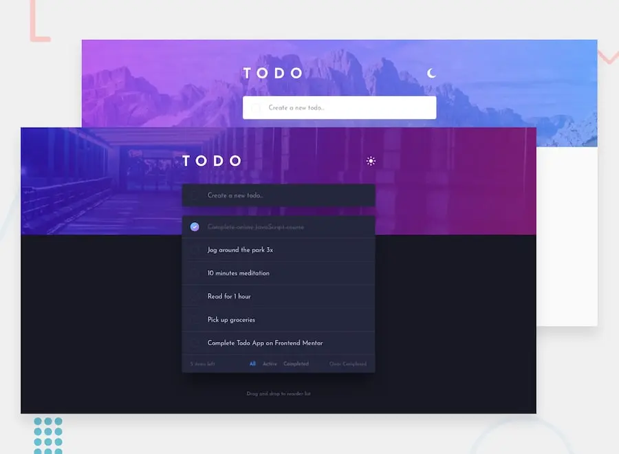

<div align="center">
  <h1>🤖 Frontend Mentor - Todo app</h1>

This is a solution to the [Todo app challenge on Frontend Mentor](https://www.frontendmentor.io/challenges/todo-app-Su1_KokOW).



</div>

## 🚀 How to use?

First clone the repository from GitHub:

```shell
git clone https://github.com/toastycoder0/todo-app-project.git
```

Move to the project folder:

```shell
cd todo-app-project
```

Install the dependencies with the following command:

```shell
npm i
```

Start the **development** environment with the following command

```shell
npm run dev
```

## ⚙️ This application was built using the following technologies

- [Vite](https://vitejs.dev/)
- [TypeScript](https://www.npmjs.com/package/typescript)
- [Standard](https://www.npmjs.com/package/ts-standard)
- [ESLint](https://www.npmjs.com/package/eslint)
- [Tailwind](https://tailwindcss.com)

## 📄 License

[MIT](https://opensource.org/licenses/MIT)
